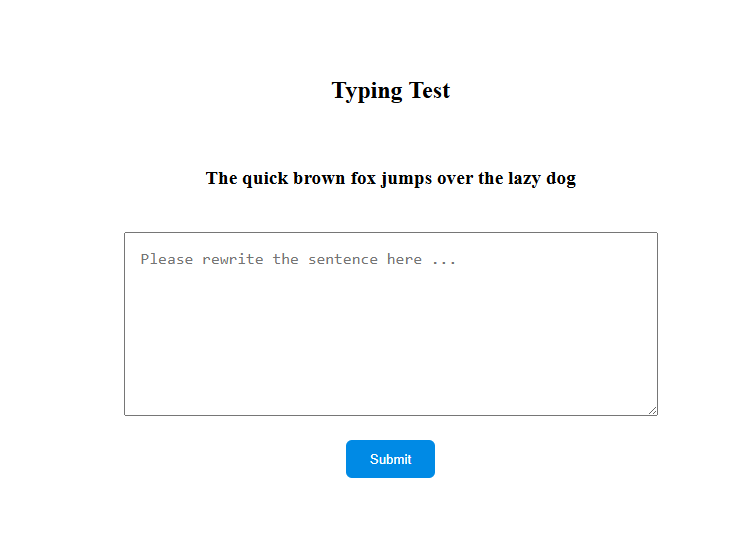
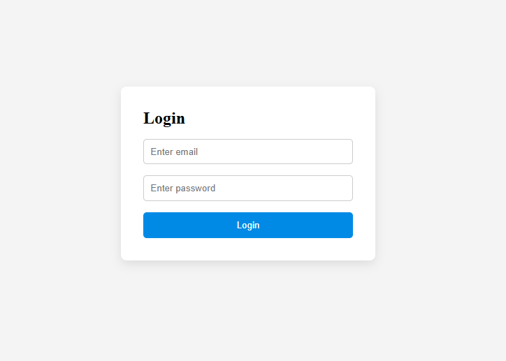
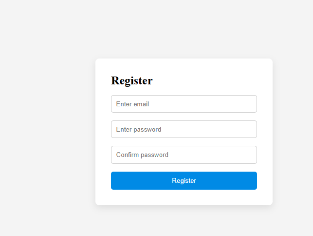

# Keystroke Dynamics Frontend

This is the frontend application for a behavioral biometric system based on keystroke dynamics.

The application captures user typing behavior and sends raw keystroke data to the backend for feature extraction and machine learning processing.

---

## 🚀 Project Overview

This project collects raw typing data such as:
- Key press timestamps
- Key release timestamps
- Dwell time
- Flight time
- Session duration
- Backspace usage

The frontend is responsible only for collecting and sending raw behavioral data.
Feature extraction and model training are handled by the backend.

---

## 🛠 Tech Stack

- React
- JavaScript
- Axios (for API calls)
- CSS

---

## 📂 Architecture

Frontend Responsibilities:
- Display typing prompt
- Capture keystroke events
- Measure timing data
- Send structured raw data to backend API

Backend Responsibilities:
- Extract statistical features
- Store processed dataset
- Train ML model

---

## 📦 Installation

Clone the repository:

git clone https://github.com/your-org/your-repo.git

Install dependencies:

npm install

Start development server:

npm run dev

---

## 🔗 API Endpoint

The frontend sends typing session data to:

POST /api/typing-session

Example payload:

{
  "promptText": "...",
  "typedText": "...",
  "startedAt": 1234,
  "finishedAt": 1450,
  "keystrokes": [...]
}

---

## 🎯 Purpose

This project is part of a behavioral biometrics system designed for:
- User authentication
- Identity verification
- Typing behavior analysis

---
## 📸 Screenshots

